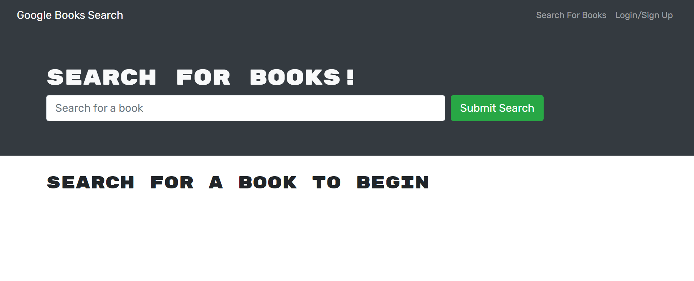
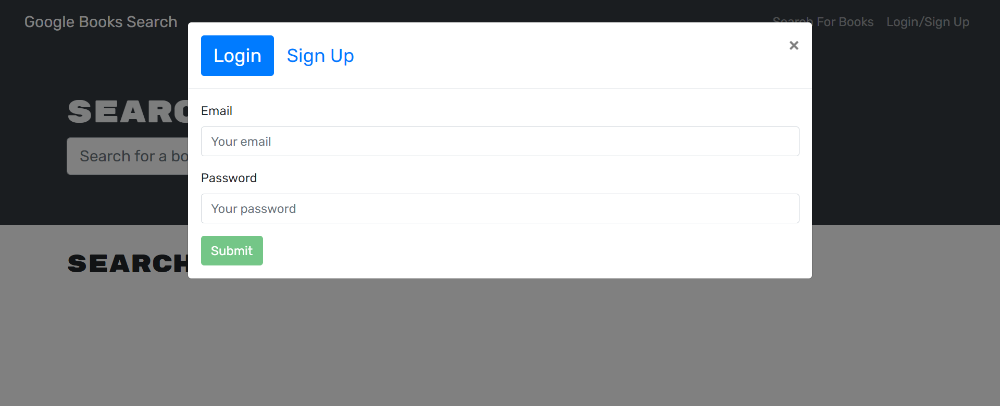
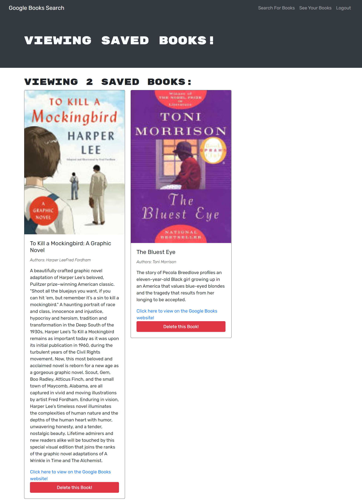

# **Alternative Book Search Engine**

## **Description**
The purpose of this project was to take a fully functional MERN stack application that was built in React with a RESTful API and to refactor it to use a GraphQL API built with an Apollo Server. This application is a book search engine website that allows users to search for books using the Google Books API and then save and delete selected books of interest.  

## **Table of Contents**
[User Story](#user-story) 
[Acceptance Criteria](#acceptance-criteria) 
[License](#license) 
[Contributing](#contributing) 
[Built With](#built-with) 
[Deliverables](#deliverables) 

### **User Story**
AS AN avid reader 
I WANT to search for new books to read 
SO THAT I can keep a list of books to purchase 

### **Acceptance Criteria**
GIVEN a book search engine 
WHEN I load the search engine 
THEN I am presented with a menu with the options Search for Books and Login/Signup and an input field to search for books and a submit button 
WHEN I click on the Search for Books menu option 
THEN I am presented with an input field to search for books and a submit button 
WHEN I am not logged in and enter a search term in the input field and click the submit button 
THEN I am presented with several search results, each featuring a book’s title, author, description, image, and a link to that book on the Google Books site 
WHEN I click on the Login/Signup menu option 
THEN a modal appears on the screen with a toggle between the option to log in or sign up 
WHEN the toggle is set to Signup 
THEN I am presented with three inputs for a username, an email address, and a password, and a signup button 
WHEN the toggle is set to Login 
THEN I am presented with two inputs for an email address and a password and login button 
WHEN I enter a valid email address and create a password and click on the signup button 
THEN my user account is created and I am logged in to the site 
WHEN I enter my account’s email address and password and click on the login button 
THEN the modal closes and I am logged in to the site 
WHEN I am logged in to the site 
THEN the menu options change to Search for Books, an option to see my saved books, and Logout 
WHEN I am logged in and enter a search term in the input field and click the submit button 
THEN I am presented with several search results, each featuring a book’s title, author, description, image, and a link to that book on the Google Books site and a button to save a book to my account 
WHEN I click on the Save button on a book 
THEN that book’s information is saved to my account 
WHEN I click on the option to see my saved books 
THEN I am presented with all of the books I have saved to my account, each featuring the book’s title, author, description, image, and a link to that book on the Google Books site and a button to remove a book from my account 
WHEN I click on the Remove button on a book 
THEN that book is deleted from my saved books list 
WHEN I click on the Logout button 
THEN I am logged out of the site and presented with a menu with the options Search for Books and Login/Signup and an input field to search for books and a submit button 

### **License**
This project is covered under the following license: ISC 
https://opensource.org/licenses/ISC

### **Contributing**
Special thanks to Scott Heier for his assistance in trouble-shooting some challenges that were encountered during the process of building this application.

### **Built With**
* React 
* JavaScript
* Node.js
* Express.js
* GraphQL
* Apollo Server
* Heroku

### **Deliverables**
### **Screenshots of Alternative Book Search Engine:**

 **Homepage** 

 

**Login/SignUp modal** 

 

**Returned Search for a Book** 

 

**Saved Books to User's Account** 

 

### **Website URL for Alternative Book Search Engine:** 
https://alt-book-search-engine.herokuapp.com/
